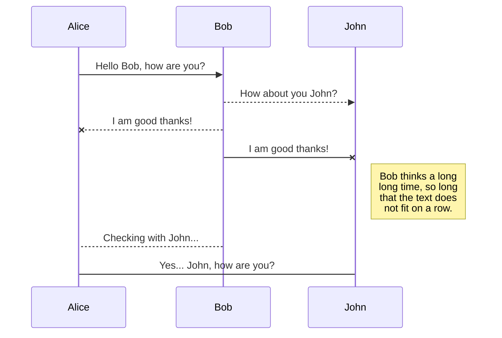

## Introdução aos Agentes de IA

Que tal compreender o que são agentes de IA, por meio de uma análogia simples?

Imagine que você é um gerente de projetos em uma empresa. Seu trabalho é coordenar várias tarefas para garantir que um projeto seja concluído com sucesso. Para isso, você conta com uma equipe de especialistas, cada um com habilidades específicas, como design, desenvolvimento, marketing e vendas.

Agora, pense em um agente de IA como esse gerente de projetos. O agente de IA é responsável por coordenar várias ferramentas e ações (sua equipe de especialistas) para alcançar um objetivo específico. Cada ferramenta ou ação tem uma função específica, assim como cada membro da equipe tem suas próprias habilidades.

## O que são LLMs (Large Language Models) ?

## Ferramentas e Ações

## Workflows com Agentes

Esse é o meu primeiro "post", no meu blog, que é gerado com o Marmite[1]!

[1]: https://github.com/rochacbruno/marmite
