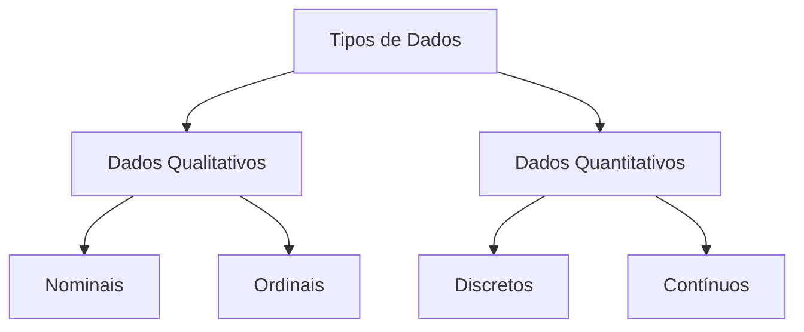

## Introdução à Estatística Descritiva

A estatística descritiva é uma área da estatística que se concentra na coleta, organização, análise e apresentação de dados de maneira resumida e informativa. Seu objetivo principal é descrever as características principais de um conjunto de dados, facilitando a compreensão e interpretação das informações.

## Tipos de Dados

Os dados podem ser classificados em dois tipos principais:

- **Dados Qualitativos**: Representam categorias ou características e podem ser nominais (sem ordem) ou ordinais (com ordem).
  - **Dados Nominais**: Categorias sem ordem específica (ex: cores, gêneros).
  - **Dados Ordinais**: Categorias com uma ordem específica (ex: classificações
- **Dados Quantitativos**: Representam quantidades e podem ser discretos (valores inteiros) ou contínuos (valores em um intervalo).
  - **Dados Discretos**: Valores inteiros (ex: número de filhos).
  - **Dados Contínuos**: Valores em um intervalo (ex: altura, peso).

## Medidas de Tendência Central

As medidas de tendência central são usadas para identificar o valor central ou típico de um conjunto de dados. As principais medidas incluem:

- **Média**: A soma de todos os valores dividida pelo número total de valores.

  $$
  \bar{x} = \frac{\sum_{i=1}^{n} x_i}{n}
  $$

- **Mediana**: O valor que separa a metade superior da metade inferior dos dados. Se o número de valores for par, a mediana é a média dos dois valores centrais.

- **Moda**: O valor que ocorre com maior frequência em um conjunto de dados.

## Medidas de Dispersão

As medidas de dispersão indicam o grau de variação ou dispersão dos dados em relação à média. As principais medidas incluem:

- **Amplitude**: A diferença entre o maior e o menor valor do conjunto de dados.

  $$
  \text{Amplitude} = x_{max} - x_{min}
  $$

- **Desvio Padrão**: Mede a dispersão dos dados em relação à média. É a raiz quadrada da variância.

  $$
  s = \sqrt{\frac{\sum_{i=1}^{n} (x_i - \bar{x})^2}{n-1}}
  $$

- **Variância**: A média dos quadrados dos desvios em relação à média.

  $$
  s^2 = \frac{\sum_{i=1}^{n} (x_i - \bar{x})^2}{n-1}
  $$

## Representações Gráficas

As representações gráficas são ferramentas visuais que ajudam a interpretar e comunicar os dados de forma eficaz. Alguns tipos comuns de gráficos incluem:

- **Histograma**: Representa a distribuição de frequências de dados contínuos.
