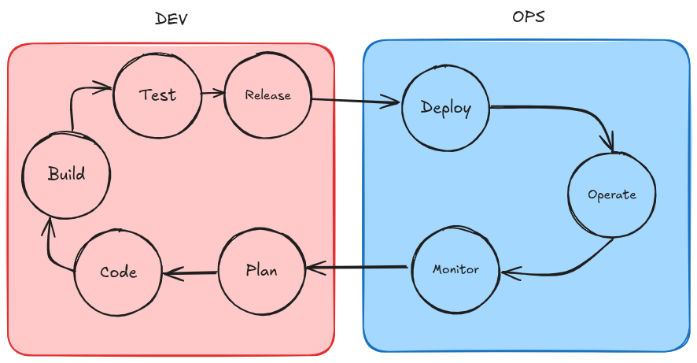

Nesse artigo, vamos explorar os fundamentos da cultura em MLOps (Machine Learning Operations) e DataOps (Data Operations), destacando a importância de práticas colaborativas, automação e integração contínua para o sucesso de projetos de ciência de dados e aprendizado de máquina.

Fundamentando inicialmente, a cultura DevOps, que é a base para MLOps e DataOps, enfatiza a colaboração entre equipes de desenvolvimento e operações para acelerar a entrega de software com alta qualidade. Essa cultura promove a automação de processos, integração contínua (CI) e entrega contínua (CD), permitindo que as equipes respondam rapidamente às mudanças e melhorem continuamente seus produtos.

## Cultura DevOps

### Cultura

Que tal primeiro a gente falar sobre o que é Cultura?

Um cara chamado [Tylor](https://pt.wikipedia.org/wiki/Edward_Burnett_Tylor), vai dizer que cultura é algo como:

> “Todo aquele **complexo** que inclui o **conhecimento**, as crenças, a arte, a moral, a lei, os **costumes** e todos os outros hábitos e capacidades adquiridos pelo homem como membro de uma **sociedade**”

Essa citação levanta alguns pontos interessantes sobre o que é cultura, como:

- **complexo:** refere-se à interconexão de diversos elementos que compõem a cultura de um grupo ou sociedade.
- **conhecimento:** abrange as informações, habilidades e experiências que os indivíduos adquirem ao longo de suas vidas.
- **costumes:** são as práticas e tradições que são transmitidas de geração em geração dentro de uma sociedade.
- **sociedade:** destaca a importância do contexto social na formação e expressão da cultura.

Você pode estar pensando:

> Como isso se relaciona com MLOps e DataOps?

A resposta está na forma como as equipes de MLOps e DataOps colaboram e compartilham conhecimento, práticas e ferramentas para alcançar seus objetivos. A cultura de colaboração e aprendizado contínuo é fundamental para o sucesso dessas abordagens.

### DevOps

Para falar de DevOps, a gente precisa pensar, em como as equipes trabalhavam antes do DevOps existir.

Antes do DevOps, as equipes de desenvolvimento (Dev) e operações (Ops) trabalhavam de forma isolada, o que muitas vezes levava a problemas de comunicação, atrasos na entrega de software e dificuldades na manutenção dos sistemas em produção. Com a introdução do DevOps, essas equipes começaram a colaborar mais estreitamente, compartilhando responsabilidades e objetivos comuns.

Com isso, a **"CULTURA DEVOPS"** surgiu, promovendo a integração entre desenvolvimento e operações, com foco em automação, monitoramento e melhoria contínua.

> [!NOTE] 🧑🏽‍💻
> **DEVOPS = DESENVOLVIMENTO (DEV) + OPERAÇÕES (OPS)**  
> DevOps é uma combinação de práticas culturais, filosóficas e técnicas que visa melhorar a colaboração entre equipes de desenvolvimento de software e operações de TI, com o objetivo de entregar software de forma mais rápida, confiável e eficiente.

#### Ciclo de Vida DevOps

<!-- markdownlint-disable MD033 -->

  

 

Na parte esquerda, temos o ciclo de vida tradicional de desenvolvimento de software, que inclui as fases de planejamento, desenvolvimento, teste, build e release.

E na parte direita, temos o ciclo de vida DevOps, que integra essas fases em um fluxo contínuo, permitindo que as equipes entreguem software de forma mais rápida e eficiente, com feedback constante e melhorias contínuas.

Ou seja, o DevOps não é apenas sobre ferramentas e processos, mas também sobre a cultura de colaboração e aprendizado contínuo entre as equipes.

#### Princípios do DevOps

Então, quais são os princípios do DevOps?

##### Integração Contínua (CI)

Prática de integrar o código desenvolvido por diferentes membros da equipe em um repositório compartilhado várias vezes ao dia, com testes automatizados para garantir a qualidade do código.

- Códigos são enviados para um repositório central (GitHub, GitLab, Bitbucket, etc).
- Testes automatizados são executados para validar o código.
- Se os testes passarem, o código é integrado ao repositório principal.
- Feedback rápido é fornecido aos desenvolvedores sobre o status do código.
- Isso ajuda a identificar e corrigir problemas rapidamente, reduzindo o risco de conflitos de código e melhorando a qualidade do software.

##### Entrega Contínua (CD)

Processo de automatizar a entrega de software para ambientes de produção, permitindo que novas funcionalidades e correções sejam lançadas rapidamente e com segurança.

- Após a integração contínua, o código é automaticamente implantado em ambientes de teste e produção.
- Testes adicionais são realizados para garantir que o software funcione corretamente em diferentes ambientes.
- Isso permite que as equipes entreguem software de forma mais rápida e confiável, respondendo rapidamente às necessidades do mercado e dos usuários, por meio de feedback constante e iterações rápidas.

##### Controle de Versão

Uso de sistemas de controle de versão, como Git, para gerenciar o código-fonte e facilitar a colaboração entre os membros da equipe.

- Git permite que os desenvolvedores trabalhem em diferentes ramificações (branches) do código, facilitando a experimentação e o desenvolvimento paralelo.
- Histórico de mudanças é mantido, permitindo reverter para versões anteriores do código se necessário.
- Facilita a colaboração entre equipes distribuídas, permitindo que todos trabalhem no mesmo código sem conflitos.

##### Microsserviços

Arquitetura que divide uma aplicação em pequenos serviços independentes, facilitando a escalabilidade e a manutenção.

- Cada serviço é responsável por uma funcionalidade específica e pode ser desenvolvido, implantado e escalado de forma independente.
- Facilita a adoção de novas tecnologias e práticas, permitindo que as equipes escolham as melhores ferramentas para cada serviço.
- Melhora a resiliência da aplicação, pois falhas em um serviço não afetam toda a aplicação.
- Permite que as equipes se concentrem em suas áreas de especialização, melhorando a eficiência e a qualidade do trabalho.

##### Infraestrutura como Código (IaC)

Prática de gerenciar e provisionar a infraestrutura de TI por meio de código, permitindo automação e consistência na configuração dos ambientes.

- Ferramentas como Terraform permite definir a infraestrutura em arquivos de configuração, que podem ser versionados e compartilhados entre as equipes.
- Facilita a criação, atualização e destruição de ambientes de forma rápida e segura, reduzindo o risco de erros humanos.
- Permite que as equipes adotem práticas de DevOps em toda a infraestrutura, promovendo a automação e a colaboração entre desenvolvimento e operações.

##### Gerenciamento de Configuração

Processo de gerenciar as configurações de software e hardware em toda a infraestrutura, garantindo consistência e controle.

- Gerenciamento de configuração ajuda a manter a integridade dos sistemas, evitando configurações divergentes que podem levar a falhas ou problemas de desempenho.
  - Conseguimos por meio disso, configurar replicação de ambientes, garantindo que os ambientes de desenvolvimento, teste e produção sejam consistentes.
- Reduz riscos de modificar a configuração do sistema, permitindo reverter para versões anteriores se necessário.
- Promove a colaboração entre equipes, garantindo que todos estejam alinhados sobre as configurações e mudanças realizadas.

##### Monitoramento Contínuo

Processo de monitorar continuamente o desempenho e a saúde dos sistemas em produção, permitindo identificar e resolver problemas rapidamente.

- Ferramentas de monitoramento, como Prometheus, Grafana, Datadog, New Relic, entre outras, permitem coletar métricas e logs em tempo real.
- Alertas são configurados para notificar as equipes sobre problemas ou anomalias, permitindo uma resposta rápida.
- Análise de dados coletados ajuda a identificar tendências e padrões, permitindo melhorias contínuas na performance e na confiabilidade dos sistemas.
- Promove a cultura de responsabilidade compartilhada, onde todas as equipes estão envolvidas na manutenção e melhoria dos sistemas em produção.

##### Automação

Automação de processos é um dos pilares do DevOps, permitindo que tarefas repetitivas sejam realizadas de forma rápida e eficiente, reduzindo erros humanos e liberando tempo para atividades mais estratégicas.

- Ferramentas de automação, como Jenkins, GitHub Actions, GitLab CI/CD entre outras, permitem criar pipelines de integração e entrega contínua.
- Automação de testes, implantação e monitoramento ajuda a garantir a qualidade e a confiabilidade do software.
- Promove a cultura de melhoria contínua, onde as equipes estão constantemente buscando formas de otimizar processos e aumentar a eficiência.

##### Colaboração e Comunicação

Cultura de colaboração e comunicação aberta entre as equipes é fundamental para o sucesso do DevOps.

- Ferramentas de comunicação, como Slack, Microsoft Teams, entre outras, facilitam a troca de informações e a colaboração em tempo real.
- Unidade de objetivos e responsabilidades compartilhadas promove um ambiente de trabalho mais harmonioso e produtivo.
- Feedback constante entre as equipes ajuda a identificar e resolver problemas rapidamente, promovendo a melhoria contínua.
- Incentiva a aprendizagem e o desenvolvimento profissional, onde as equipes estão sempre buscando novas habilidades e conhecimentos para melhorar seu trabalho.
