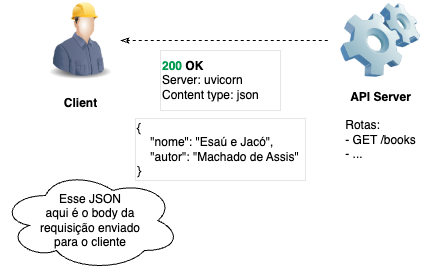

## 👋🏼 Olá, FastAPI

> [!WARNING] ⚡️
> Esse é o meu primeiro "post", relacionado ao [FastAPI](https://fastapi.tiangolo.com/)!

O FastAPI é um framework web moderno e de alto desempenho para construir APIs com Python. Ele é rápido, fácil de usar e oferece uma série de recursos que facilitam o desenvolvimento de APIs robustas e escaláveis.

Meu objetivo com esta série de posts é compartilhar conhecimentos e experiências sobre o desenvolvimento de APIs utilizando o FastAPI, abordando desde conceitos básicos até tópicos mais avançados. Espero que você aproveite e aprenda bastante com o conteúdo!

<!--
Fique à vontade para sugerir temas ou fazer perguntas nos comentários. Vamos juntos explorar o mundo do FastAPI e construir APIs incríveis!
-->

Quero passar por tópicos como:

- Introdução ao FastAPI e API
- Métodos HTTP no FastAPI
- Pydantic
- SQLModel
- AsyncIO
- PostgreSQL
- Autenticação e Autorização
- Alembic - Migrations
- Testes
- Docker
- ...

Entre outros!

Meu objetivo é trabalharmos como exemplos práticos e reais, com eventos, usuários, autenticação, banco de dados, deploy, etc.

O principal objetivo é termos conhecimento prático para desenvolver APIs RESTful utilizando o FastAPI, com boas práticas de desenvolvimento, segurança e performance.

### O que são REST APIs?

#### API

APIs (Application Programming Interfaces) permitem a comunicação entre diferentes sistemas. Elas definem como os dados devem ser solicitados, enviados e formatados.

<!-- markdownlint-disable MD033 -->
<div style="text-align:center;">
  
</div>

#### REST

REST (**RE**epresentational **S**tate **T**ransfer) é um estilo arquitetural para projetar APIs. Ele utiliza métodos HTTP (GET, POST, PUT, DELETE) para realizar operações em recursos.

##### Métodos HTTP

Os principais métodos HTTP utilizados em APIs REST são:

| Método | Descrição                         |
| ------ | --------------------------------- |
| GET    | Recupera dados de um recurso.     |
| POST   | Cria um novo recurso.             |
| PUT    | Atualiza um recurso existente.    |
| DELETE | Remove um recurso.                |
| PATCH  | Atualiza parcialmente um recurso. |

Nesse contexto, um recurso pode ser qualquer entidade que a API manipula, como usuários, produtos, pedidos, etc.

Imagine que você está acessando um app de uma livraria. Cada livro, autor, categoria, etc., são recursos que podem ser manipulados através da API.

Agora, imagine que você precise saber quais livros você já comprou. Provavelmente, o sistema vai fazer uma requisição do tipo `GET` para a API, que vai retornar os dados dos livros que você comprou.

<!-- markdownlint-disable MD033 -->
<div style="text-align:center;">
  
</div>

##### Headers

Headers são metadados enviados junto com a requisição ou resposta HTTP. Eles fornecem informações adicionais sobre a requisição ou resposta, como tipo de conteúdo, autenticação, cache, etc.

Isso é importante para a comunicação entre cliente e servidor, garantindo que ambos entendam o formato dos dados e outras informações relevantes.

##### Body

O body (corpo) é a parte da requisição ou resposta HTTP que contém os dados reais sendo enviados ou recebidos. Em requisições POST, PUT e PATCH, o body geralmente contém os dados que estão sendo criados ou atualizados.

Em respostas, o body contém os dados retornados pelo servidor, como informações de um recurso solicitado.

<!-- markdownlint-disable MD033 -->
<div style="text-align:center;">
  
</div>

##### Response Status Codes

Os códigos de status HTTP são números que indicam o resultado de uma requisição HTTP. Eles são divididos em cinco categorias principais:

| Código | Categoria        | Descrição                                                                                                                    |
| ------ | ---------------- | ---------------------------------------------------------------------------------------------------------------------------- |
| 1xx    | Informativo      | Indica que a requisição foi recebida e está sendo processada.                                                                |
| 2xx    | Sucesso          | Indica que a requisição foi bem-sucedida. Exemplo: 200 OK, 201 Created.                                                      |
| 3xx    | Redirecionamento | Indica que o cliente deve tomar ações adicionais para completar a requisição. Exemplo: 301 Moved Permanently, 302 Found.     |
| 4xx    | Erro do Cliente  | Indica que houve um erro na requisição do cliente. Exemplo: 400 Bad Request, 401 Unauthorized, 404 Not Found.                |
| 5xx    | Erro do Servidor | Indica que houve um erro no servidor ao processar a requisição. Exemplo: 500 Internal Server Error, 503 Service Unavailable. |

> [!NOTE] ℹ️
> Sendo sincera com você, eu raramente vejo códigos 1xx e 3xx sendo utilizados em APIs REST. Os mais comuns são os 2xx, 4xx e 5xx. </br></br>
> Uma curiosidade é que o código 418 **(I'm a teapot)** 🫖 é um código de status HTTP definido como uma piada no [RFC 2324](https://datatracker.ietf.org/doc/html/rfc2324), que especifica o protocolo Hyper Text Coffee Pot Control Protocol (HTCPCP). Ele indica que o servidor é um bule de chá e não pode preparar café.

Você mesmo que talvez não esteja costumado com esses códigos, mas com certeza já os viu em algum momento. Por exemplo, quando você tenta acessar uma página que não existe, você provavelmente já viu o erro 404.

Que ver na prática? Tente acessar esse link: [https://github.com/machadoah/rota-que-nao-existe](https://github.com/machadoah/rota-que-nao-existe).

Provavelmente, você verá uma página com o erro 404.

<!-- markdownlint-disable MD033 -->
<div style="text-align:center;">
  
</div>

##### Response

A resposta (response) é o que o servidor envia de volta para o cliente após processar uma requisição. Ela geralmente inclui um código de status HTTP, headers e um body com os dados solicitados ou uma mensagem de erro.

<!-- markdownlint-disable MD033 -->
<div style="text-align:center;">
  
</div>

Podemos ver ai que o servidor retornou um código de status 200, indicando que a requisição foi bem-sucedida. O body contém os dados solicitados, que nesse caso é um JSON com o nome e autor do livro [Esaú e Jacó](https://pt.wikipedia.org/wiki/Esa%C3%BA_e_Jac%C3%B3_(romance)).

### O que é o FastAPI?

<!-- markdownlint-disable MD033 -->
<div style="text-align:center;">
  
</div>

O FastAPI é um framework web moderno e de alto desempenho para construir APIs com Python. Ele é rápido, fácil de usar e oferece uma série de recursos que facilitam o desenvolvimento de APIs robustas e escaláveis.

Foi criado por [Sebastián Ramírez](https://tiangolo.com/), desde seu desenvolvimento tem ganhado popularidade rapidamente devido à sua simplicidade, desempenho e recursos avançados.

Possivelmente um dos grandes estímulos para seu crescimento foi o fato de ser simples de aprender e usar, além de ser muito bem documentado.

Já deixo aqui de antemão o link para a [documentação oficial do FastAPI](https://fastapi.tiangolo.com/), que é excelente! Até para aprender na aba de [Aprender](https://fastapi.tiangolo.com/pt/learn/)! E sim, tem em português! 🇧🇷

Ou seja, talvez você não precise nem de mim para aprender FastAPI! 😅

Mas vamos lá, vou tentar ajudar você a entender o básico para começar a usar o FastAPI, primeiro mostrando como criamos um endpoint simples.

Para isso vamos seguir pequenos passos, que são desde como uma função simples em Python pode ser transformada em um endpoint de uma API.

1. **Função simples em Python**

> [!NOTE] ℹ️
> Normalmente gosto de colocar bastantes comentários para ajudar ao máximo sua compreensão, sei que as vezes pode ser cansativo, mas é para o seu bem! 😅 </br></br>
> Acredito que às vezes menos é mais, mas nesse caso, mais é mais! 😂

Aqui temos uma função simples em Python que recebe um nome como parâmetro e retorna uma mensagem de saudação.

```python
def read_message(my_name: str):
    return {"message": f"Hello {my_name}"}
```

<!-- markdownlint-disable MD029 -->
2. **Transformando a função em um endpoint de API com FastAPI**

Agora, vamos transformar essa função em um endpoint de uma API usando o FastAPI. Para isso, precisamos instalar o FastAPI!

> [!NOTE] ℹ️
> **CALMA!** </br>
> Não precisa sair instalando tudo agora, só quero que você entenda o conceito. Depois a gente vê como instalar e configurar tudo direitinho. 😅 </br>
> Vamos ter um passo a passo bem detalhado em posts futuros. 😉

Agora aqui está o código para transformar a função em um endpoint de API com FastAPI:

```python
# Importa a classe FastAPI do módulo fastapi
from fastapi import FastAPI

# Cria uma instância da aplicação FastAPI
app = FastAPI()

#       👇🏽 Aqui temos a rota que será acessada
@app.get("/hello/{my_name}")
#    👆🏼 Aqui temos o método HTTP que estamos usando
async def read_message(my_name: str):
    return {"message": f"Hello {my_name}"}
```

Nesse código, criamos uma instância do FastAPI e definimos um endpoint `/hello/{my_name}` que aceita requisições GET. A função `read_message` agora é assíncrona (usando `async def`) e recebe o parâmetro `my_name` da URL.

### Por que usar o FastAPI?

Para construir APIs em Python, existem vários frameworks disponíveis, como [Flask](https://flask.palletsprojects.com/en/stable/) e [Django](https://www.djangoproject.com/).

No entanto, o FastAPI oferece várias vantagens que o tornam uma escolha atraente para muitos desenvolvedores.

O FastAPI é rápido, fácil de usar, baseado em padrões modernos e oferece suporte nativo para validação de dados, documentação automática e muito mais. Além disso, ele é altamente escalável e pode lidar com um grande número de requisições simultâneas, tornando-o ideal para aplicações de alta performance. Essas características fazem do FastAPI uma excelente escolha para desenvolver APIs RESTful de forma eficiente e produtiva.

O FastAPI é construído sobre o [Starlette](https://www.starlette.io/) para a parte web e o [Pydantic](https://pydantic.dev/) para a validação de dados. Isso significa que ele herda a performance e a flexibilidade do Starlette, além de aproveitar o poder do Pydantic para garantir que os dados recebidos e enviados pela API estejam corretos.

O Django, por outro lado, é um framework web completo que inclui um ORM (Object-Relational Mapping), sistema de templates, autenticação, entre outros recursos. Ele é mais adequado para aplicações web completas, onde você precisa de uma solução integrada para gerenciar tanto o backend quanto o frontend, para criar um projeto é necessário mais configuração inicial.

O Flask é um microframework que oferece mais flexibilidade e controle sobre a estrutura da aplicação. Ele é leve e fácil de aprender, mas pode exigir mais trabalho para configurar e adicionar funcionalidades adicionais, como autenticação, validação de dados, etc, coisas que o FastAPI já oferece nativamente.

<!-- markdownlint-disable MD033 -->
<div style="text-align:center;">
  
</div>

Na imagem acima, podemos ver a evolução do número de estrelas no GitHub dos três frameworks ao longo do tempo. O FastAPI tem mostrado um crescimento impressionante, refletindo sua popularidade crescente na comunidade de desenvolvedores. Chegando até a ultrapassar o Flask e o Django em número de estrelas.
